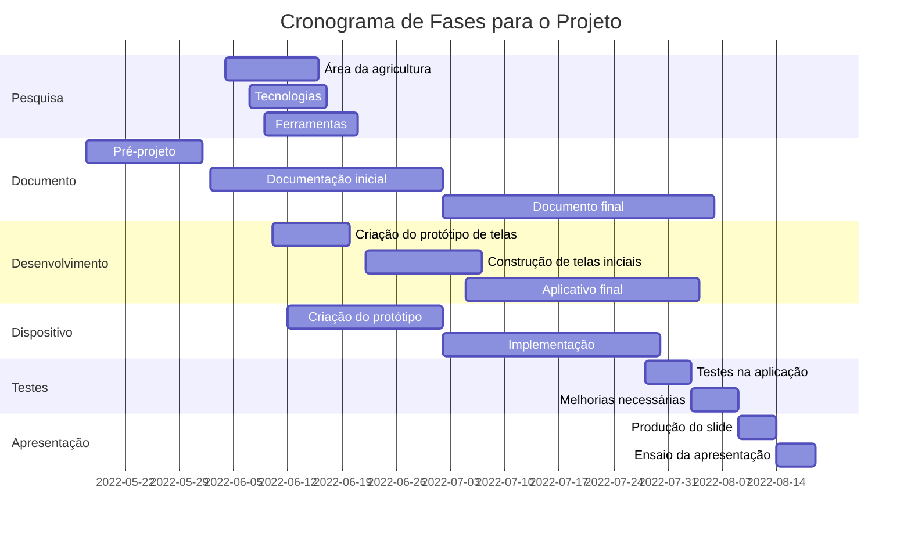

# Projeto Integrador II

CURSO: TECNOLOGIA EM SISTEMAS PARA INTERNET

TEMA: SISTEMA DE GERENCIAMENTO PARA FRUTAS E HORTALIÇAS

GRUPO: 

       - FERNANDA BEATRIZ TAVARES GOMES

       - POLIANA DE ARAUJO PEREIRA

       - JONATHAN LEONCIO DE SOUZA LIRA
       
## Diagrama de Gantt

## Conhecimentos para o Desenvolvimento
Nessa parte iremos falar sobre conhecimentos e ferramentas das disciplinas estudadas, para o desenvolvimento desse projeto.

### Desenvolvimento de Dispositivos Móveis
Consiste no desenvolvimento de um aplicativo (software) responsável por exibir informações ao usuário sobre o nível de maturidade de algumas frutas e hortaliças, através de dados coletados pelo dispositivo em Arduino, dados como temperatura, umidade com recomendação para melhor ambiente, temperatura e umidade adequadas, para a melhor conservação desses alimentos. Esse aplicativo será desenvolvido em Delphi, no ambiente de desenvolvimento Rad Studio, multiplataforma, podendo ser acessado em qualquer dispositivo, facilitando o acesso para os dispositivos móveis (Celulares, Tablets). Na disciplina estamos aprendendo sobre o desenvolvimento pelo Rad Studio, Delphi, funcionalidades, APIs, Design; e poderemos utilizar tudo isso para o projeto.
### Programação para Internet das Coisas
Será utlizada para o dispositivo em Arduino, conciliado com sensores de umidade e temperatura, para fazer a coleta de dados das frutas e hortaliças, gerenciando controle de amadurecimento e dias de duração, sugerindo melhorias relacionadas a ambiente, transporte, temperatura, umidade e outros fatores. Buscando atráves desse gerenciamento reduzir fatores de aprodrecimento e do desperdicio de frutas e verduras. Visando utilizar dos conhecimentos obtidos na disciplina, tais como utilização de Arduino, Sensores, atuadores, conexões, programação, utiliando plataforma como: Tinkercad para simulação, Node Red, Programa do Arduino e outros fatores e funcionalidades.
### Teste de Software 
Em todo projeto ou software é necessário a fase de testes, para o melhor desenvolvimento, buscando falhas, propondo melhorias e a melhor utilização dos usuários. Visto isso, e a forma de desenvolvimento do software, optamos por utilizar O Delphi, no Rad Studio também, que é um ambiente que permite encontrar soluções para a proposta de projeto, como também formas integradas de testes nesse aplicativo. 

Também será utilizado a fase de teste no dispositivo, visto que p setor de alimentos (frutas e hortaliças), desde o seu cultivo até à sua comercialização ao cliente, nesse percurso há uma série de processos pelo qual exige dados precisos em tempo real por meio de equipamentos de leitura de indicadores de condições climáticas, integrado à IoT. Dessa forma, disponibilizam por meio dos dados que se transformam em informações com mais exatidão na qualidade final desses produtos, evitando possíveis perdas e desperdícios comuns nesse setor de hortifruti. Nesse contexto, a linguagem Delphi é considerada mais apropriada por suportar testes em tempo real e possibilitar facilmente a correção de erros de programação em script de Banco de Dados, APIs, entre outros.

Conhecimentos esses obtidos na disciplina de Teste de Software, referente a ferramenta Rad Studio, como também melhores formas e funcionalidades na realização de testes no aplicativo e etc.

