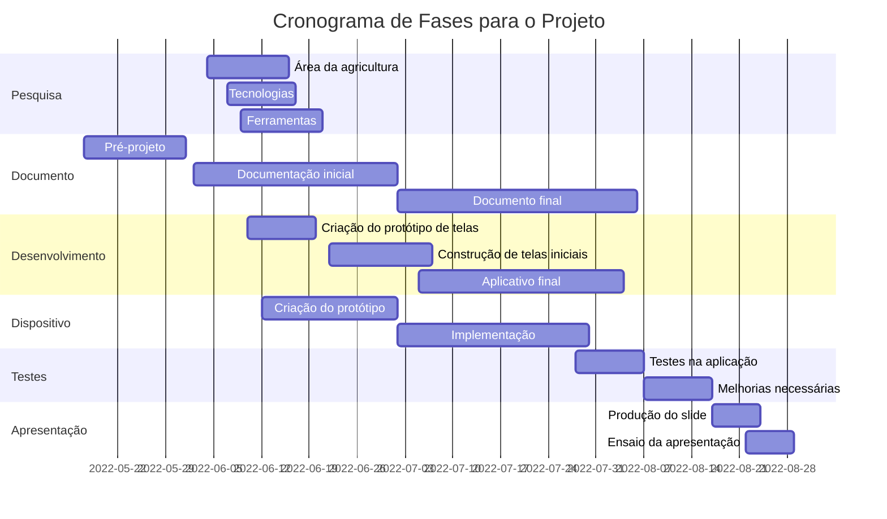

# Projeto Integrador II

CURSO: TECNOLOGIA EM SISTEMAS PARA INTERNET

TEMA: SISTEMA DE GERENCIAMENTO PARA FRUTAS E HORTALIÇAS

GRUPO: 

       - FERNANDA BEATRIZ TAVARES GOMES

       - POLIANA DE ARAUJJO PEREIRA

       - JONATHAN LEONCIO DE SOUZA LIRA
       
## Diagrama de Gantt

