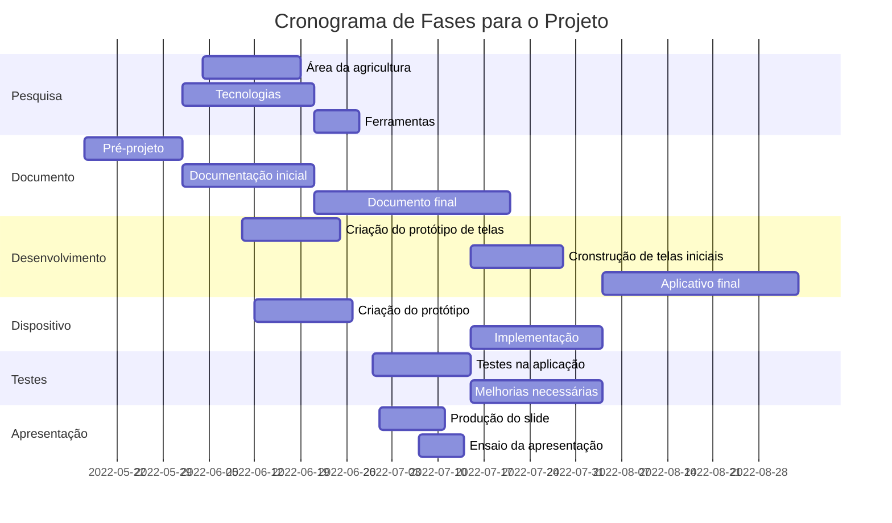

# ProjetoIntegrador

## Diagrama de Gantt

```mermaid
    gantt
    title Cronograma de Fases para o Projeto
    dateFormat  YYYY-MM-DD
    section Pesquisa
    Área da agricultura     :a1, 2022-06-04, 15d
    Tecnologias  :a2,after a1  , 20d
    Ferramentas  :a3,after a2, 7d
    section Documento
    Pré-projeto     :a1, 2022-05-17, 15d
    Documentação inicial   :a2,after a1  , 20d
    Documento final  :a3,after a2, 30d
    section Desenvolvimento
    Criação do protótipo de telas  :c2,2022-06-10  , 15d
    Cronstrução de telas iniciais     :c3,after c2, 14d
    Aplicativo final     :c4,after c3, 30d
     section Dispositivo
    Criação do protótipo  :c2,2022-06-12  , 15d
    Implementação     :c3,after c2, 20d
       section Testes
    Testes na aplicação  :c2,2022-06-30  , 15d
    Melhorias necessárias     :c3,after c2, 20d
    section Apresentação
    Produção do slide  :p1, 2022-07-01, 10d
    Ensaio da apresentação :p2, 2022-07-07, 7d   
``` 
